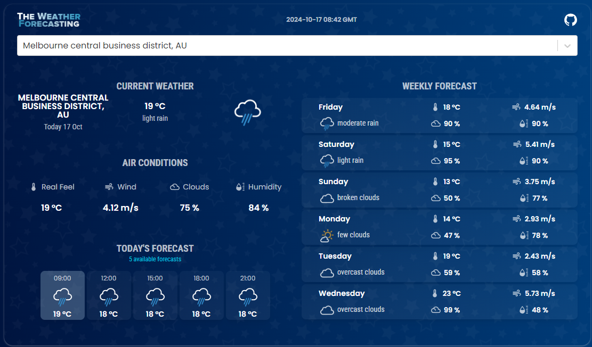

 
 
Weather Forecasting Application
 
## Overview
 
- This project is a weather forecasting application that allows users to search for any city and view the weather forecast for the next 5-6 days, along with 3-hour interval details. The app is developed using React.js and Material-UI, and it retrieves weather data through the OpenWeatherMap API.

With [The Weather Forecasting](https://the-weather-forecasting.netlify.app) user can search locations by city name and observe the weather for the next 5-6 days and 3 hour interval.
 
The app is developed using React.js and material-UI.

 

## 💻 Live Demo:

https://the-weather-forecasting.netlify.app

 

## Features
- Search for weather forecasts by city name.
- View weather information for the next several days with detailed forecasts in 3-hour intervals.
- A user-friendly interface developed with Material-UI components.

## ✨ Getting Started
## Prerequisites
- Before you can run this project, ensure that the following are installed on your system:
- Node.js
- npm
- Additionally, you will need an API key from [OpenWeatherMap](https://openweathermap.org/) after creating an account, [grab your key](https://home.openweathermap.org/api_keys).
- Then, under the `src` directory, go to `api/OpenWeatherService` and replace `WEATHER_API_KEY` with your OpenWeatherMap API Key.
  - **`api/OpenWeatherService.js`**: It contains the code related to the back-end of the application.

 

## ⚡ Installation

- Clone this repository to your local machine:

bash
git clone https://github.com/gundarasakshay/Assignment-2---Project---Weather-Forecasting.git

- Navigate to the project directory:

bash
cd Assignment-2---Project---Weather-Forecasting

- Install the required dependencies using npm:

bash
npm install

- Replace the placeholder API key with your actual OpenWeatherMap API Key:
- Go to src/api/OpenWeatherService.js and replace WEATHER_API_KEY with your own API key.
Start the application:

bash
npm start

 

## Technologies Used
- React.js: JavaScript library for building user interfaces.
- Material-UI: A popular React UI framework for creating responsive, modern UIs.
- OpenWeatherMap API: Provides real-time weather data.

 

## Libraries

- React.js
- Material-UI

Refer to the package.json file for a full list of dependencies.

 
 

## Future Enhancements
 - Styled-components: Integrate for better modular styling.
 - TypeScript Conversion: Migrate the project to TypeScript for type safety.
 - Unit Testing: Add unit tests for various components.
 - User Location: Automatically fetch the weather based on the user’s geolocation.
 - Temperature Conversion: Add Celsius/Fahrenheit toggle.
 - Dark/Light Mode: Add theme toggle functionality.

 

License - This project is licensed under the MIT License - see the LICENSE file for details.

Thank You ☺
